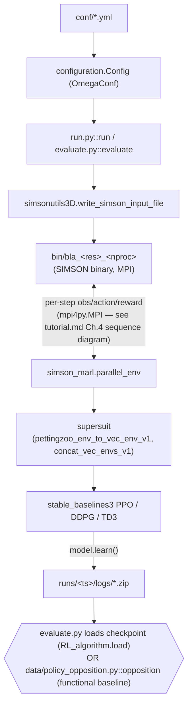

# marl-drag-reduction Developer Guide

> Baseline: `master` branch as cloned. For contributors who need to read source, extend the framework, or submit upstream PRs.

---

## 1. Project positioning & scope

marl-drag-reduction implements a multi-agent deep-reinforcement-learning (MARL) environment for turbulent drag reduction in an open channel flow, coupling the SIMSON pseudo-spectral DNS solver (provided only as a compiled binary under `bin/`, see `README.md` "Known issues") to a PettingZoo-style parallel RL environment (`src/simson_marl.py::parallel_env`). Control is applied as blowing/suction at the wall; each wall-normal "jet" region is a separate agent that observes local flow quantities and outputs a control amplitude.

Headline capabilities:
- A `pettingzoo.ParallelEnv` wrapper (`src/simson_marl.py::parallel_env`) around the SIMSON solver, exposing per-agent observations/actions/rewards for wall-normal jet control.
- Training entry point (`src/run.py::run`) driving `stable_baselines3` PPO/DDPG/TD3 agents via `supersuit` vectorization.
- A functional (non-learned) opposition-control baseline policy (`data/policy_opposition.py::opposition`) usable as a drop-in alternative to a trained agent during evaluation.
- Evaluation entry point (`src/evaluate.py::evaluate`) that replays either a trained checkpoint or a functional policy against the environment, deterministically.

## 2. Metadata snapshot

- Package name: `MARL_simson` (`setup.py`)
- License: GNU GPLv3 (`LICENSE.md`)
- Language runtime: Python 3 (no explicit `python_requires`; solver requires a `singularity` container per `README.md` "Pre-requisites")
- Core dependencies (from imports in `src/run.py`, `src/evaluate.py`, `src/simson_marl.py`): `torch`, `stable_baselines3`, `supersuit`, `pettingzoo`, `gym`, `omegaconf`, `mpi4py`, `numpy`, `yaml`, `matplotlib`. No `requirements.txt`/`pyproject.toml` exists at the repo root — no version is pinned anywhere in the repo; the list above is inferred from imports alone (see also `user_guide.md` §2, which cross-references this fact rather than restate it).
- Version source: `setup.py` (`version='0.0.1'`)

## 3. Repository layout

```
marl-drag-reduction/
├── bin/            compiled SIMSON solver binaries (bla_<nx>x<ny>x<nz>_<nproc>); source not distributed
├── conf/           YAML run configs (training + evaluation, minimal/larger channel)
├── data/           initial velocity fields (data/baseline/) + functional policies (policy_opposition.py)
├── notebooks/      postprocessing notebooks for training/evaluation runs
├── runs/           per-run output folders (env_000/, env_test_***/, logs/); 3 shipped: 100, 101, 1672737751
├── src/            all Python source: configuration.py, run.py, evaluate.py, simson_marl.py, simsonutils3D.py
│   └── simson_MARL/   package entry points (__init__.py, __main__.py) exposing `python -m simson_MARL`
└── setup.py
```

## 4. Runtime architecture overview



Narrative: `run.py::run` reads a YAML config into a `configuration.Config` dataclass tree (`src/configuration.py::Config`), writes the SIMSON `bla.i` input file (`src/simsonutils3D.py::write_simson_input_file`), copies the appropriate precompiled solver binary into a fresh `runs/<run_name>/env_<rank>/` folder, then constructs `simson_marl.parallel_env` and wraps it with `supersuit` so it can be driven by a single-agent-style `stable_baselines3` algorithm. `evaluate.py::evaluate` mirrors this setup but instead of training, either loads a saved `stable_baselines3` checkpoint (`RL_algorithm.load(...)`) or a functional policy module dynamically imported from `data/*.py` (`importlib.machinery.SourceFileLoader`).

## 5. Top-level namespace

| Alias | Real module |
| --- | --- |
| `python -m simson_MARL run <conf.yml>` | `src/run.py::run` (via `src/simson_MARL/__main__.py`) |
| `python -m simson_MARL evaluate <conf.yml>` | `src/evaluate.py::evaluate` |
| `python -m simson_MARL conf <conf.yml>` | `src/configuration.py::parse_cli` |

Source: `src/simson_MARL/__main__.py` (imports `add_subparser` from `configuration.py`, `run.py`, `evaluate.py` and dispatches via `argparse` subcommands).

## 6. Backend / platform abstraction

> Skipped: there is no multi-backend indirection. The RL algorithm choice (`PPO`/`DDPG`/`TD3`) is a plain `if/elif` in `src/run.py::run` selecting a `stable_baselines3` class directly — not a plugin/adapter registry.

## 7. Data & domain layer

The "data" layer is the pair of things `src/simson_marl.py::parallel_env` needs at reset: an initial DNS velocity field (`conf.simulation.init_field`, default `data/baseline/init.u`, `src/configuration.py::Simulation.init_field`) and, for evaluation only, a functional control policy module under `data/` (e.g. `data/policy_opposition.py::opposition`). `data/README.md` documents the naming convention: a policy file `policy_[name].py` must define a function `[name](observation, **kwargs)` returning a per-agent scalar action, with optional parameters overridable via a sibling `kwargs-[name].yml`.

No `__all__`-based package exists here (this is a scripts/data repo, not a library) — the closest analogue is `src/configuration.py::Config`, whose 3 sub-dataclasses (`Simulation`, `Runner`, `Logging`) enumerate every tunable parameter; see `conf/README.md` for the annotated list.

## 8. Automatic differentiation / computation core

> Skipped: no custom automatic-differentiation layer. Gradients are computed entirely inside `stable_baselines3`'s PyTorch policy/value networks; the repo does not expose or wrap AD directly.

## 9. Networks / models catalog

| Class | Path | Constructor signature |
| --- | --- | --- |
| `PPO` | `stable_baselines3.ppo.PPO` (third-party; selected in `src/run.py::run`) | `PPO('MlpPolicy', env, verbose=3, policy_kwargs=policy_kwargs, n_steps=conf.runner.train_steps)` |
| `DDPG` / `TD3` | `stable_baselines3.DDPG` / `.TD3` (third-party) | `RLA('MlpPolicy', env, verbose=3, buffer_size=conf.runner.buffer_size, policy_kwargs=policy_kwargs, action_noise=action_noise, train_freq=(conf.runner.train_steps, "step"), gradient_steps=conf.runner.gradient_steps)` |
| `opposition` (functional, not learned) | `data/policy_opposition.py::opposition` | `opposition(observation, alpha=1, limit_amp=False, amp=0.04285714285714286)` |

Custom policy network architectures (`policy_kwargs`) are optionally loaded from a YAML file at `conf.runner.policy_file` (default `conf/default_policy.yml`) when `conf.runner.custom_policy` is `True` — see `conf/default_custom_policy.yml` for the expected format.

## 10. Optimizers & schedulers

- Available optimizer/algorithm names (`conf.runner.RL_algorithm`, `src/configuration.py::Runner.RL_algorithm`): `PPO`, `DDPG`, `TD3`.
- No LR-decay/scheduler matrix is exposed in `configuration.py` — `stable_baselines3` defaults apply unless overridden via `policy_kwargs` (see also `tutorial.md` Chapter 5, which cross-references this fact rather than restate it).

## 11. Training main loop

Step-by-step narrative of `src/run.py::run`:

1. **Config parse** — `parse_omegaconf` merges `configuration.Config()` defaults, the given `conf_file`, and CLI dotlist overrides via `omegaconf.OmegaConf`.
2. **Input-file staging** — `simsonutils3D.write_simson_input_file(conf)` renders the SIMSON `bla.i` input; the matching precompiled binary is copied from `conf.runner.bin_root` into a fresh `runs/<run_name>/env_<rank>/` folder.
3. **Env construction** — `SimsonEnv.parallel_env(conf=conf, rank_folder=rank_folder)` (aliasing `simson_marl.py`), then wrapped with `supersuit.pettingzoo_env_to_vec_env_v1` and `concat_vec_envs_v1` so multiple per-agent PettingZoo steps present as one vectorized Gym env to `stable_baselines3`.
4. **Agent construction** — one of `PPO`/`DDPG`/`TD3` per §9/§10 above.
5. **`model.learn(total_timesteps=nctrlx*nctrlz*nb_interactions*nb_episodes, callback=checkpoint_callback)`** — the actual training call; a `stable_baselines3.common.callbacks.CheckpointCallback` (see §12) periodically writes checkpoints to `runs/<run_name>/logs/`.
6. **`model.save(f"policy_{conf.runner.agent_run_name}")`** — a final save at the end of the run (in the current working directory, not `runs/<run_name>/logs/` — see TODO below).

Confirmed by reading `src/run.py` that `model.save(f"policy_{conf.runner.agent_run_name}")` is a bare relative path (writes to the process's current working directory), genuinely distinct from `CheckpointCallback`'s `run_folder+'/logs/'`. Also confirmed (`src/evaluate.py:136-137`): `evaluate()` loads exclusively from the checkpoint path (`f"{run_folder}/logs/{conf.runner.agent_run_name}-{conf.runner.policy}"`), never from the final-save path — so nothing in this repo actually consumes `run.py`'s final `model.save(...)` output. Not runtime-tested: whether that final save is an intentional "latest" convenience pointer or dead code cannot be determined from source alone.

## 12. Callback / hook system

Lifecycle: a single `stable_baselines3.common.callbacks.CheckpointCallback` instance is passed to `model.learn(..., callback=...)`; `stable_baselines3` invokes it internally after each rollout/update per its own `save_freq` schedule — this repo does not define a custom callback base class or lifecycle of its own.

| Built-in callback | Trigger | Use case |
| --- | --- | --- |
| `CheckpointCallback` (`stable_baselines3.common.callbacks`, used in `src/run.py::run`) | every `conf.runner.nb_interactions * conf.runner.ckpt_int` env steps | periodic checkpoint of the policy to `runs/<run_name>/logs/<run_name>-rl_model*.zip` |

## 13. Loss & metric registries

> Skipped: no custom loss/metric registry exists in this repo. Training minimizes whatever internal objective `stable_baselines3`'s PPO/DDPG/TD3 implementation uses; the only "reward" customization point is `src/configuration.py::Runner.rew_mode` (`Instantaneous` or `MovingAverage`), consumed inside `simson_marl.py`'s step logic.

## 14. Parallel / distributed training

Parallelism here is MPI between the Python RL loop and the compiled SIMSON solver process (`mpi4py.MPI`, `src/configuration.py::Simulation.mpi_drlf`, `nproc`), not data-parallel RL training. `README.md`'s "Known issues" section documents a real MPI-slot exhaustion race when one environment instance closes while another opens, with a documented workaround (an MPI `hostfile` with an inflated `slots=` count, passed via `conf.runner.hostfile` / `--hostfile`).

## 15. Contribution SOPs & debugging

### 15.1 Dev environment

```bash
git clone https://github.com/KTH-FlowAI/MARL-drag-reduction-in-wall-bounded-flows.git
# Download the Singularity container "marl-channelflow" (see top-level README.md), then:
singularity shell --bind /path/to/repository marl-channelflow
cd /path/to/repository/marl-drag-reduction/src/
```

### 15.2 Adding a new functional (non-learned) policy

1. Add `data/policy_<name>.py` defining `def <name>(observation, **kwargs)` returning a scalar action (`data/README.md`).
2. Optionally add `data/kwargs-<name>.yml` for default keyword arguments.
3. Set `runner.policy: policy_<name>.py` and `runner.learnt_policy: False` in the evaluation config; `evaluate.py::evaluate` dynamically imports it via `importlib.machinery.SourceFileLoader`.

### 15.3 Common error → root cause

| Symptom | Check |
| --- | --- |
| MPI errors when an environment is closed and a new one opens on a 4-core machine | `README.md` "Known issues" — create an MPI `hostfile` with an inflated `slots=` count and pass `--hostfile`. |
| `ValueError: The folder containing the trained agent does not exist` (`run.py::run`, `evaluate.py::evaluate`) | `conf.runner.agent_run_name` points at a `runs/<name>` folder that was never created — verify the run name/timestamp. |
| `ValueError: This wall boundary condition option is not available` (`simson_marl.py::parallel_env.__init__`) | `conf.simulation.wbci` must be `6` (opposition control) or `7` (MARL); other values are not implemented for this environment. |

---

## References

- Main paper / canonical citation: full citation in [README.md § Introduction](../../README.md#introduction) — per this repo's own `README.md`. See the citation note in [`README.md`](./README.md) (this `docs/guides/` folder) regarding the addendum's differing hypothesis.
- Online docs: none beyond this repository's own `README.md` files (`/README.md`, `conf/README.md`, `data/README.md`, `runs/README.md`, `src/README.md`).
