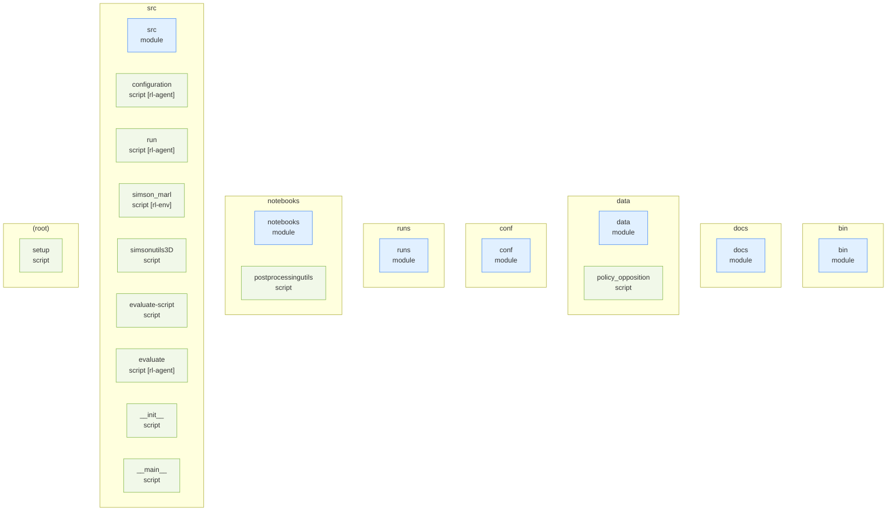
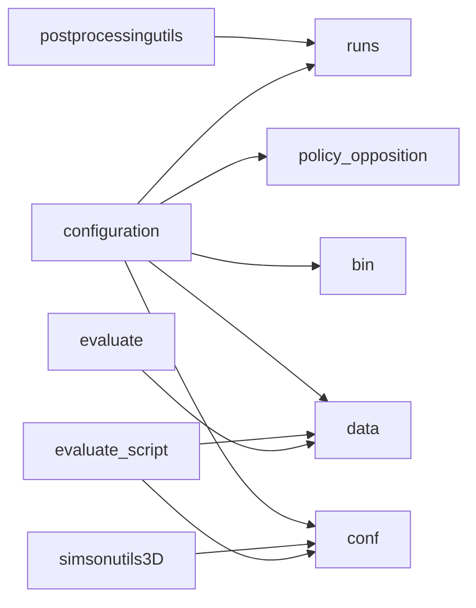

# marl-drag-reduction — Repository Topology Map

> Auto-generated by `repo-doc-miner/scripts/gen_topology.py` (v2, topology-first). This is the **first deliverable** of the mining process: a structural map of the repository. Refine the detected edges by reading the most important manifests, then deep-dive each module along these edges.

---

## 1. Structural Topology

## 2. Dependency Edges

Solid arrows = `uses`; dotted `... synced` arrows = `source → copy` (single source of truth synced into copies); dotted `"data: <prefix>"`-labeled arrows = `data-contract` (one entity writes a file another loads — no direct import/require between them).

## 3. Entity Inventory

| Kind | Count | Example locations |
| --- | --- | --- |
| script | 11 | `data/policy_opposition.py, notebooks/postprocessingutils.py, setup.py` |
| module | 7 | `bin, conf, data` |

## 4. Excluded as Vendored

Dropped-in third-party library copies (matched by directory name or by an embedded package marker such as `setup.py`/`PKG-INFO` next to an `__init__.py`, or a sibling `*.dist-info`/`*.egg-info`) are excluded from every section above — they are not the repo's own code, and their generic `save()`/`load()` methods would otherwise flood the data-contract detector with false positives.

- none detected

## 5. Detected Pipelines

Linear data-contract chains (writer → reader → reader → ...) of 3+ entities, found by following each `data-contract` edge to the end of its chain. Chains of 1-2 edges stay in the Dependency Edges graph above only — not worth a separate diagram.

No data-contract chain of 3+ entities detected (0 data-contract edges found at all — this repo's real data flow runs through the compiled SIMSON solver subprocess and `conf.logging.save_dir`-based run folders, not literal/same-file-variable `save`/`load` calls this detector matches).

## 6. Module Deep-Dive Scaffold

> Walk these modules **along the dependency edges above**, highest complexity first. Replace each `> TODO(doc-miner)` with findings.

### bin

- **bin** (module) — `bin`
  - > TODO(doc-miner): what does bin do and which entities does it reference?

### docs

- **docs** (module) — `docs`
  - > TODO(doc-miner): what does docs do and which entities does it reference?

### data

- **data** (module) — `data`
  - > TODO(doc-miner): what does data do and which entities does it reference?
- **policy_opposition** (script) — `data/policy_opposition.py` (~0 KB)
  - Implements the `opposition(observation, alpha=1, limit_amp=False, amp=...)` functional policy: action = `-alpha * mean(observation[0])` (the wall-normal-velocity plane), optionally clipped to `±amp`. This is `configuration.py::Runner.policy`'s default (`'policy_opposition.py'`).

### conf

- **conf** (module) — `conf`
  - > TODO(doc-miner): what does conf do and which entities does it reference?

### runs

- **runs** (module) — `runs`
  - > TODO(doc-miner): what does runs do and which entities does it reference?

### notebooks

- **notebooks** (module) — `notebooks`
  - > TODO(doc-miner): what does notebooks do and which entities does it reference?
- **postprocessingutils** (script) — `notebooks/postprocessingutils.py` (~1 KB)
  - Two helpers used by the `notebooks/*.ipynb` pair: `eval_stats_reader` parses `runs/<timestamp>/env_<i>/`'s SIMSON log text (regex over "Calculate statistics"/"y=ny"/"px =" lines) into a Re_tau/px history array; `running_mean(x, N)` is a plain cumulative-sum moving average.

### src

- **src** (module) — `src`
  - > TODO(doc-miner): what does src do and which entities does it reference?
- **configuration** (script) — `src/configuration.py` (~6 KB)
  - Defines the `omegaconf`-structured config dataclasses (`Runner`, `Simulation`, `Logging`, `Config`) covering every RL/solver/logging parameter, plus `add_subparser`/`parse_cli` for the `python -m simson_MARL conf` CLI subcommand (prints the merged, resolved YAML).
- **run** (script) — `src/run.py` (~6 KB)
  - Training entry point: `run(conf_file, overrides)` merges config via `parse_omegaconf`, writes the SIMSON `bla.i` input (`simsonutils3D.write_simson_input_file`), builds `simson_marl.parallel_env` wrapped through `supersuit` into a vectorized Gym env, constructs a `PPO`/`DDPG`/`TD3` agent, and calls `model.learn(..., callback=CheckpointCallback(...))` — see `developer_guide.md` §11 for the full step-by-step and the confirmed final-`model.save()` path discrepancy.
- **simson_marl** (script) — `src/simson_marl.py` (~25 KB)
  - The actual PettingZoo multi-agent environment: `RingBuffer` (fixed-size circular buffer for observation history) plus `parallel_env(ParallelEnv)` (with `raw_env`/`env` factory wrappers), which drives the compiled SIMSON solver binary as a subprocess via `mpi4py` and exposes per-jet agents' blowing/suction actions and reward.
- **simsonutils3D** (script) — `src/simsonutils3D.py` (~6 KB)
  - `write_simson_input_file(conf, folder='')` serializes the `Simulation` config dataclass into SIMSON's fixed-format `bla.i` text input file, consumed by the compiled solver binary at `conf.runner.bin_root`.
- **evaluate-script** (script) — `src/evaluate-script.sh` (~0 KB)
  - Sbatch-style loop over a fixed checkpoint-step schedule (`ckpt=6144000`, hardcoded `tstamp="1672737751"`) and a range of initial conditions, launching `python3 -m simson_MARL evaluate ../conf/MC16_trained.yml runner.policy=... runner.rank=...` in parallel background processes per checkpoint × initial-condition pair.
- **evaluate** (script) — `src/evaluate.py` (~13 KB)
  - Evaluation entry point: `evaluate(conf_file, overrides)` rebuilds the env/config the same way as `run.py`, then loads a trained model via `RL_algorithm.load(f"{run_folder}/logs/{agent_run_name}-{policy}", ...)` (confirmed: this reads the `CheckpointCallback` path, not `run.py`'s final `model.save()` output — see `developer_guide.md` §11) and replays it deterministically.
- **__init__** (script) — `src/simson_MARL/__init__.py` (~0 KB)
  - Empty — just the shebang/encoding header; makes `src/simson_MARL/` an importable package with no re-exports.
- **__main__** (script) — `src/simson_MARL/__main__.py` (~0 KB)
  - `python -m simson_MARL` entry point: wires `run`, `evaluate`, and `conf`'s `add_subparser` functions into one `argparse` CLI and dispatches to `args.cmd(**vars(args))`.

### (root)

- **setup** (script) — `setup.py` (~0 KB)
  - Standard `setuptools` packaging: `name='MARL_simson'`, `version='0.0.1'`, `author="Luca Guastoni"`, packages discovered under `src/` — the source for the citation-note author check in `README.md`.

---

> Refine this map, then use it as the backbone for `developer_guide.md`, `user_guide.md`, and `tutorial.md`.