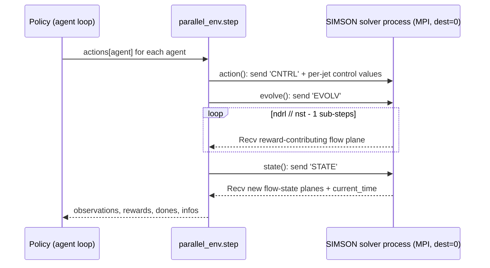

# marl-drag-reduction From Beginner to Expert Tutorial

> Ten chapters, progressively deeper. Every chapter is anchored in a real script or config under this repository (there is no `examples/` folder here — the closest analogue is `conf/` for configs and `src/` for entry points).

## Table of contents

- Chapter 1 — Environment setup & Hello example
- Chapter 2 — Domain / input space basics
- Chapter 3 — Constraints: action range and rescaling
- Chapter 4 — Time-dependent problem: the MPI control loop
- Chapter 5 — Convergence techniques
- Chapter 6 — Evaluating a trained agent
- Chapter 7 — Scaling up: minimal vs. larger channel
- Chapter 8 — Operator learning *(not applicable — skipped, see note)*
- Chapter 9 — Acceleration: MPI and multi-core
- Chapter 10 — Mastery

---

## Chapter 1 · Environment setup & Hello example

Install / setup:

```bash
git clone https://github.com/KTH-FlowAI/MARL-drag-reduction-in-wall-bounded-flows.git
singularity shell --bind /path/to/repository marl-channelflow
```

First runnable command (adapted from the top-level `README.md`, using the functional opposition-control policy so no training is needed):

```bash
cd /path/to/repository/marl-drag-reduction/src/
mpiexec -n 1 python3 -m simson_MARL evaluate ../conf/opposition.yml
```

Expected result: the SIMSON solver runs the minimal channel with opposition control active at the wall; observation/action traces are written under `runs/<run_name>/env_test_000/` if `runner.vars_record: True` is set in the config.

**Exercise** — Open `conf/opposition.yml` and change `runner.nb_interactions` to a smaller value; confirm the run finishes faster.

---

## Chapter 2 · Domain / input space basics

The simulated domain is a full 3D channel-flow DNS case, not a synthetic sampling domain. Its size and resolution come entirely from `src/configuration.py::Simulation` (`xl`, `nx`, `ny`, `nz`, `Re_cl`), rendered to the solver's native `bla.i` format by `src/simsonutils3D.py::write_simson_input_file`.

Representative example configs: `conf/MC16_scale_t300_g64.yml` (minimal channel, `nx=nz=16`) and `conf/LC64_scale_t300_g64.yml` (larger channel, `nx=nz=64`).

**Exercise** — Diff `conf/MC16_scale_t300_g64.yml` against `conf/LC64_scale_t300_g64.yml` and list every `simulation.*` field that differs.

---

## Chapter 3 · Constraints: action range and rescaling

Rather than boundary/initial conditions in the PDE-constraint sense, the relevant "constraint" here is the control action range: `runner.ctrl_min_amp` / `runner.ctrl_max_amp` (`src/configuration.py::Runner`). `src/evaluate.py::evaluate` automatically detects a mismatch between a loaded model's action range and the environment's configured range and rescales (`env.rescale_actions`, `env.rescale_factors`), printing a warning when it does so.

**Exercise** — Trace through `src/evaluate.py::evaluate`'s rescaling block (search for `rescale_factor`) and state, in one sentence, what happens if the loaded model's action range and the environment's configured range have opposite signs.

---

## Chapter 4 · Time-dependent problem: the MPI control loop

Example: `src/simson_marl.py::parallel_env.step` — every control step, the environment exchanges the current flow-state observation and each agent's action with the SIMSON solver process over `mpi4py.MPI`, at an interval controlled by `simulation.ndrl` (number of solver iterations between actions).

```python
# Conceptual shape of one control step (see src/simson_marl.py::parallel_env.step
# for the real MPI exchange):
for i in range(conf.runner.nb_interactions):
    actions = {agent: policy(observations[agent]) for agent in possible_agents}
    observations, rewards, dones, infos = env.step(actions)
```

The real MPI exchange inside one `env.step(actions)` call (`src/simson_marl.py::parallel_env.action/evolve/state`, confirmed against the `Send`/`Recv` calls and message tags):



Workflow: `nb_interactions` actions are taken per episode; `nb_episodes` episodes make up one training run (see `developer_guide.md` §11 for the exact `total_timesteps` formula used in `model.learn`).

**Exercise** — Compute `total_timesteps` for a run with `nctrlx=nctrlz=4`, `nb_interactions=100`, `nb_episodes=200` using the formula in `src/run.py::run`.

---

## Chapter 5 · Convergence techniques

- Checkpointing: `runner.ckpt_int` controls how often (in units of `nb_interactions`) `CheckpointCallback` saves a checkpoint during `model.learn` (`src/run.py::run`).
- Algorithm choice affects stability/sample-efficiency trade-offs: `PPO` (on-policy) vs. `DDPG`/`TD3` (off-policy, replay-buffer based — tune `runner.buffer_size` and `runner.action_noise`).
- Input normalization: `runner.normalize_input` (`"None"`, `"utau"`, or `"std"`) rescales the observation before it reaches the policy network.
- No learning-rate-decay or early-stopping mechanism is exposed in `configuration.py` (see [`developer_guide.md` §10 Optimizers & schedulers](./developer_guide.md#10-optimizers--schedulers)).

**Exercise** — Switch `runner.RL_algorithm` from `PPO` to `DDPG` in a training config and identify which additional `Runner` fields (§10 of `developer_guide.md`) become relevant.

---

## Chapter 6 · Evaluating a trained agent

Example: `src/evaluate.py::evaluate`, `runner.learnt_policy: True` branch.

```bash
cd src/
mpiexec -n 1 python3 -m simson_MARL evaluate ../conf/LC64_trained.yml
```

What this does, concretely (`src/evaluate.py::evaluate`):
1. Sets `logging.run_name` to `runner.agent_run_name` (the training run's timestamp) and `runner.load_agent = True`.
2. Builds the same `parallel_env` used in training.
3. Loads the saved `stable_baselines3` checkpoint with `RL_algorithm.load(...)`.
4. Runs `runner.nb_interactions` deterministic steps (`deterministic=True` in `loaded_model.predict(...)`), optionally recording observations/actions to a `.npz` file if `runner.vars_record: True`.

**Exercise** — Set `runner.vars_record: True` in a copy of `conf/opposition.yml`, rerun evaluation, and locate the resulting `vars_record_*.npz` file under the run's `env_test_*` folder.

---

## Chapter 7 · Scaling up: minimal vs. larger channel

Pointers into `conf/`:
- `conf/MC16_scale_t300_g64.yml` / `conf/MC16_trained.yml` — minimal channel (16×16 in-plane resolution).
- `conf/LC64_scale_t300_g64.yml` / `conf/LC64_trained.yml` — larger channel (64×64 in-plane resolution); requires the `bin/bla_64x65x64_2` binary instead of `bin/bla_16x65x16_2`.

**Exercise** — Identify which `bin/bla_*` binary a given config selects, by tracing `conf.simulation.nx/ny/nz/nproc` through the `shutil.copy(...)` call in `src/run.py::run`.

---

## Chapter 8 · Operator learning

> Not applicable — skipped. This repo has no data-driven or physics-informed operator-learning component; control is learned via model-free DRL against a live simulator, not by learning a solution operator from data.

---

## Chapter 9 · Acceleration: MPI and multi-core

- Multi-core: the SIMSON solver itself runs on `simulation.nproc` cores (2 by default; the shipped binaries are named `bla_<nx>x<ny>x<nz>_<nproc>`).
- MPI slot exhaustion: on 4+ physical-core machines, closing one environment instance while opening the next can race for MPI slots; the top-level `README.md` documents an MPI `hostfile` workaround with an inflated `slots=` count.
- No mixed-precision, forward-mode-AD, or multi-GPU support is exposed anywhere in this repo's config surface or source; `stable_baselines3`/PyTorch defaults apply if any.

**Exercise** — Write a minimal MPI `hostfile` declaring 8 slots for `localhost` and pass it via `--hostfile` to an evaluation run.

---

## Chapter 10 · Mastery

Pick any of the following extension points and implement a small patch:

1. Custom functional policy — add `data/policy_<name>.py::<name>(observation, **kwargs)` per `data/README.md`, following the pattern in `data/policy_opposition.py`.
2. Custom policy network — supply `runner.custom_policy: True` and a `policy_kwargs` YAML at `runner.policy_file` (see `conf/default_custom_policy.yml`).
3. Custom RL algorithm — extend the `if/elif` in `src/run.py::run` to add another `stable_baselines3` algorithm class.
4. Custom reward mode — extend `runner.rew_mode` beyond `Instantaneous`/`MovingAverage` inside `src/simson_marl.py`.
5. Custom backend (advanced) — not applicable; there is no backend-abstraction layer to extend (see `developer_guide.md` §6).

**Exercise** — Implement a new functional policy (e.g. a fixed-amplitude constant-blowing policy) and evaluate it against the shipped `opposition` baseline using the same config, comparing `runs/<name>/env_test_*/vars_record_*.npz` outputs.

---

## After this tutorial

- Deep source reading: [`developer_guide.md`](./developer_guide.md).
- API lookup: [`user_guide.md`](./user_guide.md).
- Canonical paper: full citation in [README.md § Introduction](../../README.md#introduction).
