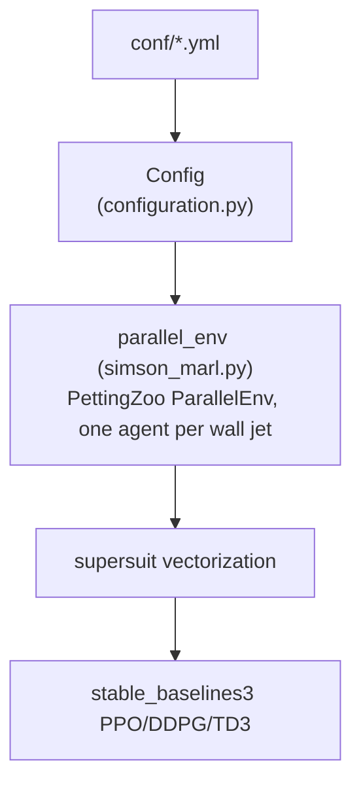

# marl-drag-reduction User Guide

> For end users and applied engineers who want to solve real problems with marl-drag-reduction.

---

## 1. What marl-drag-reduction can do

- Train a multi-agent DRL policy (PPO, DDPG, or TD3 via `stable_baselines3`) that applies wall-normal blowing/suction to reduce drag in an open turbulent channel flow, using the SIMSON DNS solver as the environment dynamics (`src/run.py::run`).
- Evaluate a trained policy, a functional baseline (opposition control), or an untrained/uncontrolled case, deterministically, and record observation/action traces (`src/evaluate.py::evaluate`).
- Scale between two channel sizes shipped as example configs: a "minimal" channel (`MC16_*.yml`) and a "larger" channel (`LC64_*.yml`), under `conf/`.

## 2. Installation

There is no `pip`-installable package; the code is meant to run inside a provided Singularity container because the SIMSON solver's source is not distributed (only compiled binaries under `bin/`).

```bash
git clone https://github.com/KTH-FlowAI/MARL-drag-reduction-in-wall-bounded-flows.git
# Download the Singularity container "marl-channelflow" (link in the top-level README.md)
singularity shell --bind /path/to/repository marl-channelflow
```

No `requirements.txt`/`environment.yml` is present; Python dependencies are presumably preinstalled inside the Singularity container (see [`developer_guide.md` §2 Metadata snapshot](./developer_guide.md#2-metadata-snapshot) for the full inferred list and confirmation that nothing is pinned anywhere in the repo).

## 3. Choosing a backend / runtime

> Not applicable in the multi-backend sense the template anticipates. The only runtime choice exposed is the RL algorithm, via `runner.RL_algorithm` in the config: `PPO`, `DDPG`, or `TD3` (`src/configuration.py::Runner.RL_algorithm`, consumed in `src/run.py::run`).

## 4. Global configuration

```yaml
# conf/opposition.yml (example — evaluation with the functional opposition policy)
runner:
  learnt_policy: False
  policy: policy_opposition.py
simulation:
  wbci: 6   # opposition control
```

Key knobs (`src/configuration.py::Runner`, documented in `conf/README.md`):
- `RL_algorithm` — which `stable_baselines3` algorithm to train (`PPO`/`DDPG`/`TD3`).
- `policy` — for evaluation, either a saved-model zip name or a `policy_<name>.py` functional-policy file under `data/`.
- `nb_episodes`, `nb_interactions`, `ckpt_int` — episode count, actions per episode, and checkpoint interval.

## 5. Core-object map



## 6. Geometry / domain definition

The "domain" is the SIMSON channel-flow case, parameterized entirely through `src/configuration.py::Simulation` (channel length `xl`, resolution `nx`/`ny`/`nz`, Reynolds number `Re_cl`, timestep `dt`, etc.) and written to the solver's own `bla.i` input format by `src/simsonutils3D.py::write_simson_input_file`. There is no user-facing geometry-composition API (no CSG-style primitives) — the two shipped example geometries are the minimal channel (`conf/MC16_*.yml`, `nx=nz=16`) and larger channel (`conf/LC64_*.yml`, `nx=nz=64`).

## 7. Boundary / initial conditions

Boundary condition is selected via `simulation.wbci` (`src/configuration.py::Simulation.wbci`), consumed in `src/simson_marl.py::parallel_env.__init__`:
- `wbci = 6` — opposition control, single tunable amplitude.
- `wbci = 7` — localized multi-agent control (the MARL case).
- Other values raise `ValueError("This wall boundary condition option is not available")`.

Initial condition: `simulation.init_field` (default `data/baseline/init.u`); `runner.random_init` selects among multiple numbered initial-condition files if more than one is available.

## 8. Data objects

| Class | When to use |
| --- | --- |
| `src/simson_marl.py::RingBuffer` | Internal moving-average buffer used when `runner.rew_mode == "MovingAverage"`. |
| `data/policy_opposition.py::opposition` (functional policy) | Baseline control during evaluation when `runner.learnt_policy == False`. |
| `stable_baselines3` checkpoint (`.zip`, saved by `CheckpointCallback` / `model.save`) | Trained-policy evaluation when `runner.learnt_policy == True`. |

## 9. PDE residual / constraint authoring

> Not applicable — there is no PDE-residual authoring API. The physics is entirely inside the compiled SIMSON solver; the RL side only exchanges observations/actions/rewards over MPI (`mpi4py`) each control step, inside `src/simson_marl.py::parallel_env.step`.

## 10. Networks

```python
# src/run.py — PPO example
from stable_baselines3 import PPO
model = PPO('MlpPolicy', env, verbose=3, policy_kwargs=policy_kwargs,
            n_steps=conf.runner.train_steps)
```

Built-ins: `stable_baselines3`'s `MlpPolicy` for PPO/DDPG/TD3 (third-party, not defined in this repo). A custom architecture can be supplied via `runner.custom_policy: True` + `runner.policy_file` pointing at a YAML of `policy_kwargs` (see `conf/default_custom_policy.yml`).

## 11. Training

```bash
cd src/
mpiexec -n 1 python3 -m simson_MARL run ../conf/learning_conf_filename.yml
```

Key options (`src/configuration.py::Runner`, overridable on the command line, e.g. `runner.nb_episodes=10`): `RL_algorithm`, `nb_episodes`, `train_steps`, `ckpt_int`, `custom_policy`, `action_noise`/`buffer_size` (DDPG/TD3 only).

## 12. Inverse problems

> Not applicable to this repo — no parameter-identification / inverse-problem workflow exists.

## 13. Operator learning

> Not applicable — there is no operator-learning (DeepONet-style) component.

## 14. Uncertainty quantification & multifidelity

> Not applicable — not implemented in this repo.

## 15. Persistence

```python
# Saving (src/run.py, end of run.py::run):
model.save(f"policy_{conf.runner.agent_run_name}")
# periodic checkpoints are also written by CheckpointCallback to runs/<run_name>/logs/

# Loading (src/evaluate.py::evaluate):
loaded_model = RL_algorithm.load(
    f"{run_folder}/logs/{conf.runner.agent_run_name}-{conf.runner.policy}",
    custom_objects={'action_space': env.action_space('jet_z0_x0')})
```

The periodic `CheckpointCallback` save path (`run_folder+'/logs/'`) and `run.py`'s final `model.save(f"policy_{conf.runner.agent_run_name}")` call (a bare relative path — the current working directory) do not match. Confirmed by reading `src/evaluate.py:136-137` directly: `evaluate()` loads from `f"{run_folder}/logs/{conf.runner.agent_run_name}-{conf.runner.policy}"` — the checkpoint path shown above, not the final-save path. The final `model.save(...)` output is not consumed by any script in this repo; whether it's an intentional convenience pointer or dead code is not runtime-tested (see `developer_guide.md` §11).

## 16. Visualization & post-processing

Two Jupyter notebooks under `notebooks/` (`training-postprocessing.ipynb`, `evaluation-postprocessing.ipynb`) use helpers from `notebooks/postprocessingutils.py` to load and plot run outputs.

> TODO(doc-miner): notebook contents were not read line-by-line in this pass (evidence-gathering focused on the `src/` training/evaluation path); only their existence and helper module are confirmed.

## 17. Parallel training

MPI parallelism between the RL loop and the SIMSON solver process — see `developer_guide.md` §14 for the documented MPI-slot workaround for multi-core machines.

## 18. Troubleshooting

| Symptom | Suggestion |
| --- | --- |
| MPI errors after closing/reopening an environment on a 4+ core machine | Create an MPI `hostfile` with an inflated `slots=` count and pass `--hostfile /full/path/to/hostfile` (top-level `README.md`, "Known issues"). |
| `ValueError: This wall boundary condition option is not available` | Set `simulation.wbci` to `6` (opposition control) or `7` (MARL) — no other value is implemented (`src/simson_marl.py::parallel_env.__init__`). |
| Solver source unavailable | The SIMSON solver source is not distributed; only compiled binaries under `bin/` are provided. Contact the paper's correspondence author for compiled executables of other configurations (top-level `README.md`). |

## 19. Minimal runnable templates

### 19.1 Training

```bash
cd src/
mpiexec -n 1 python3 -m simson_MARL run ../conf/MC16_scale_t300_g64.yml
```

### 19.2 Evaluation (functional opposition-control baseline)

```bash
cd src/
mpiexec -n 1 python3 -m simson_MARL evaluate ../conf/opposition.yml
```

## 20. Further reading

- Developer guide: [`developer_guide.md`](./developer_guide.md)
- Tutorial: [`tutorial.md`](./tutorial.md)
- Canonical paper: full citation in [README.md § Introduction](../../README.md#introduction).
